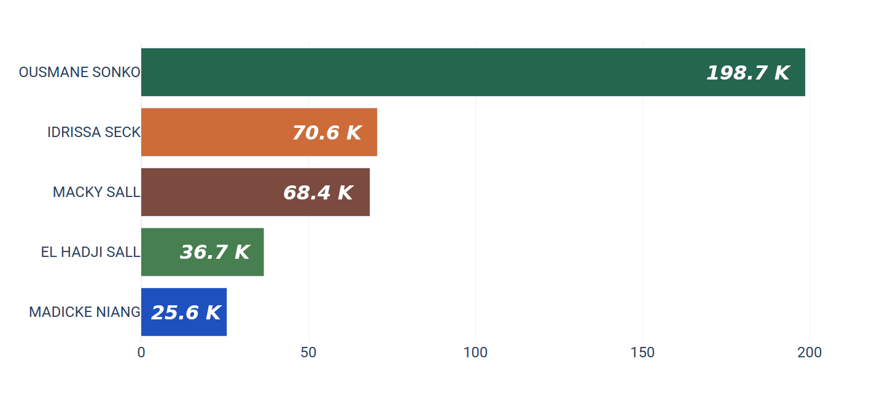

# Pop Senegal
Élection présidentielle 2019, réactions sur la page Facebook de la **RTS1 Sénégal**.



Décompte de chaque réaction sur les posts des candidats à élection présidentielle 2019 du Sénégal. Toutes ces données sont exportées sous forme de fichier CSV et peuvent être importées dans n’importe quel programme d’analyse de données comme Excel.

## Mise à jour
**Date: 2019-02-08 10:36:50.911758**

## Métadonnée
```
* status_id
* status_message
* elect
* status_type
* status_link
* video_views
* status_published
* num_reactions
* num_comments
* num_shares
* num_likes
* num_loves
* num_wows
* num_hahas
* num_sads
* num_angrys
```

## Télécharger

Cliquez [**ici**](https://github.com/senegalouvert/Pop-Senegal/archive/master.zip) pour télécharger ou sur **clone or download**

## Contribuer

Lisez s'il vous plait [CONTRIBUTING.md](CONTRIBUTING.md) pour plus de détails sur notre code de conduite et le processus de soumission des demandes de contribution.

## Auteurs

* **Mamadou Diagne**

## Licence

Ce projet est sous licence MIT - voir le fichier [LICENSE](LICENSE) pour plus de détails.

## Source

* **Facebook** - *[RTS1 Sénégal](https://www.facebook.com/RTS1.Senegal/)*